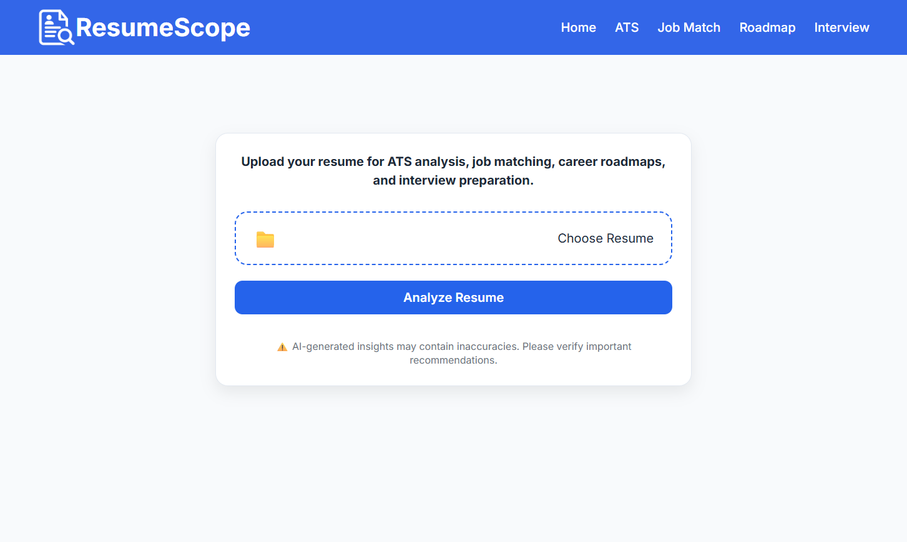
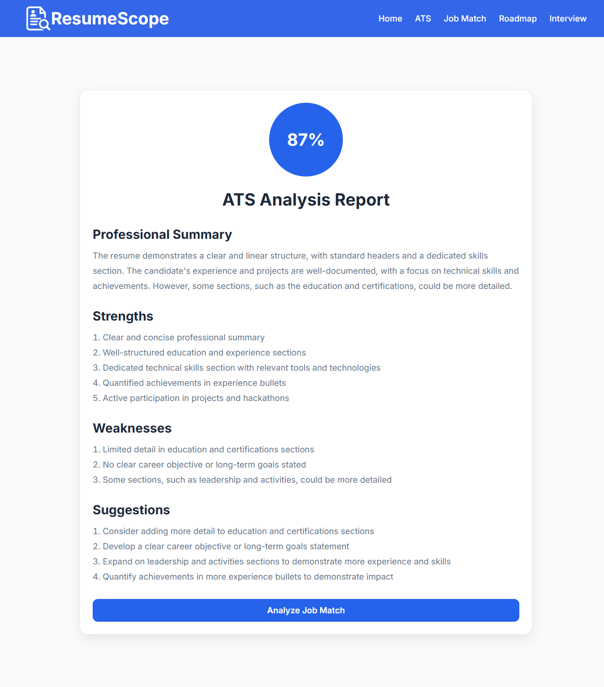
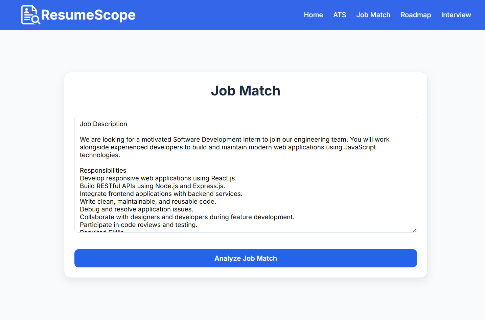
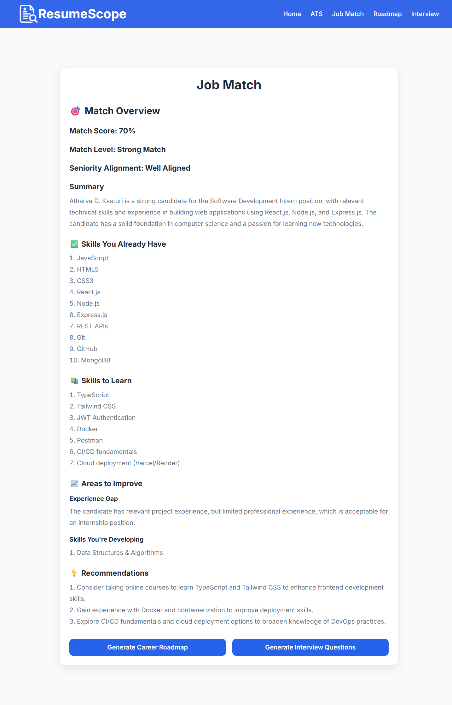
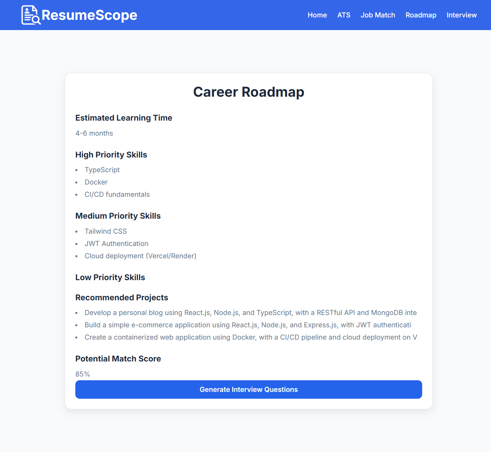
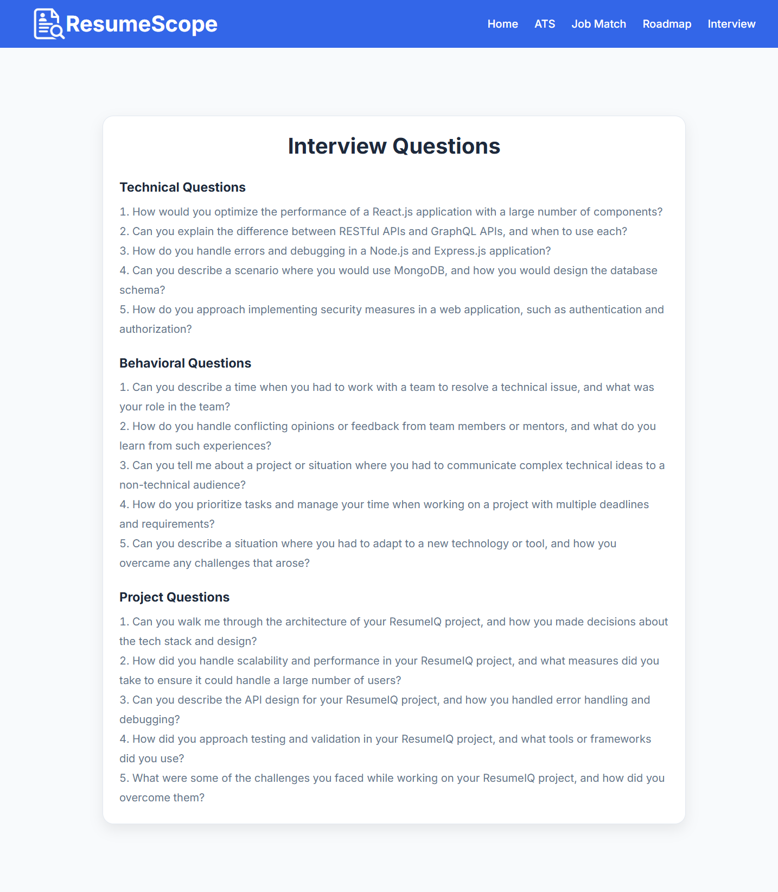

<p align="center">
  
</p>

# 🚀 ResumeScope


### AI-Powered Full-Stack Resume Analyzer

Build smarter resumes with AI-powered feedback, ATS analysis, job matching, personalized career roadmaps, and interview preparation—all in one place.

ResumeScope is a full-stack React + Express web application that helps job seekers improve their resumes using Groq LLM APIs.

It analyzes resumes, calculates ATS scores, compares resumes against job descriptions, generates personalized career roadmaps, and creates interview questions through an intuitive web interface.

🌐 **Live Demo:** https://resume-scope-lac.vercel.app

⚙️ **Backend API:** https://resumescope-backend.onrender.com

---

## ✨ Features

- 📄 Upload and analyze resumes in PDF format
- 📊 Generate ATS scores with detailed resume feedback
- 🎯 Compare resumes against job descriptions
- 🗺️ Generate personalized career roadmaps
- 💼 Create role-specific interview questions
- ⚡ Fast inference using Groq LLM APIs
- 🛡️ PDF validation with user-friendly error handling
- 🧹 Automatic cleanup of uploaded files after processing
- 🌐 Deployed on Vercel and Render

---

## 🛠️ Tech Stack

### Frontend

- React.js
- Vite
- JavaScript
- Axios
- CSS

### Backend

- Node.js
- Express.js
- Multer
- pdf-parse
- dotenv

### AI & LLM

- Groq API
- Llama 3.3 70B Versatile

### Deployment

- Vercel
- Render

### Development Tools

- Git
- GitHub
- npm

---

## 🏗️ Architecture

The following diagram illustrates the overall flow of the application, from resume upload to AI-powered analysis and dashboard rendering.

```text
React Frontend
       │
       ▼
Express REST API
       │
       ▼
Resume Controller
       │
       ├── PDF Service
       ├── ATS Analysis Service
       ├── Job Match Service
       ├── Career Roadmap Service
       └── Interview Service
       │
       ▼
Groq LLM API
       │
       ▼
JSON Response
       │
       ▼
React Dashboard
```

---

## 📸 Screenshots

Explore the application's user interface and key features below.

| Home Page | ATS Dashboard |
|-----------|---------------|
|  |  |

| Job Description | Job Match |
|-----------------|-----------|
|  |  |

| Career Roadmap | Interview Questions |
|----------------|---------------------|
|  |  |

---

## 📂 Project Structure

```text
resume-scope/
│
├── frontend/
│   ├── public/
│   ├── src/
│   │   ├── components/
│   │   ├── context/
│   │   ├── pages/
│   │   ├── services/
│   │   ├── utils/
│   │   └── App.jsx
│   └── package.json
│
├── backend/
│   ├── controllers/
│   ├── middleware/
│   ├── routes/
│   ├── services/
│   ├── uploads/
│   ├── server.js
│   └── package.json
│
├── assets/
├── README.md
└── LICENSE
```

---

## 🚀 Getting Started

### Prerequisites

- Node.js (v18 or later)
- npm

### 1. Clone the repository

```bash
git clone https://github.com/atharvakasturi7/resume-scope.git
cd resume-scope
```

> **Note:** Replace the repository URL above with your actual GitHub repository name if it differs.

### 2. Install dependencies

**Frontend**

```bash
cd frontend
npm install
```

**Backend**

```bash
cd backend
npm install
```

### 3. Configure environment variables

Create a `.env` file inside the `backend` directory:

```env
GROQ_API_KEY=your_groq_api_key
PORT=3000
```

### 4. Start the application

**Backend**

```bash
cd backend
npm run dev
```

**Frontend**

```bash
cd frontend
npm run dev
```

---

## 📡 REST API Endpoints

| Method | Endpoint | Description |
|--------|----------|-------------|
| POST | `/resume/upload` | Upload a resume and generate ATS analysis |
| POST | `/resume/match-job` | Compare a resume with a job description |
| POST | `/resume/career-roadmap` | Generate a personalized career roadmap |
| POST | `/resume/interview` | Generate interview questions |
| GET | `/health` | Check backend server health |

---

## 👨‍💻 Author

**Atharva Kasturi**

- **GitHub:** https://github.com/atharvakasturi7
- **LinkedIn:** https://www.linkedin.com/in/atharvakasturi/

---

## 📄 License

This project is licensed under the **MIT License**.
